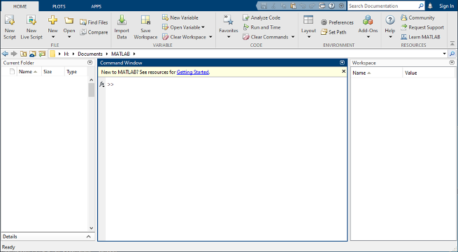

# Week 1 - MATLAB Fundamentals
Reminder - the best place to learn MATLAB (or anything, really) is the internet! [StackOverflow](https://stackoverflow.com) and MathWorks' own [MATLAB Exchange](https://www.mathworks.com/matlabcentral/)
are filled to the brim with people asking and answering questions about MATLAB. [MATLAB's own documentation](https://www.mathworks.com/help/matlab/) is also extensive and extremely helpful.
It includes descriptions of how to call functions as well as usage examples.

[Return to Lectures](https://jacksonburns.github.io/MATLAB-Start-to-Finish/Lectures/Lectures-Landing-Page)

## What is MATLAB?
Started as a simple program intended to give students an easy way to manipulate matrix-based data, hence **Mat**rix **Lab**oratory. Has grown over time
to include support for signal processing, machine learning, solving differential equations, and more.

## Which version of MATLAB do I buy?
To satisfy course requirements at the University of Delaware, and just generally to make MATLAB more useful you will need a couple of Toolboxes. These
are the MATLAB equivalent of Python packages like numpy or SciPy - they add functionality to the base program. For our program, we recommend the
Symbolic Math Toolbox and Curve Fitting Toolbox, both of which can be bought separately or come bundled in the *Student Suite*. UD has remote computing
resources available, but they came with all the typical limitations of remote computing and for the highly discounted price of the Student License for
MATLAB I think it is worth saving yourself the headache.

## Layout of the MATLAB User Interface
The main window of MATLAB has three major components, the Current Folder, Command Window, and Workspace:


(taken from [MathWorks](https://www.mathworks.com/help/matlab/learn_matlab/desktop.html))

The current folder is the same as your File Explorer. It shows you the folder that MATLAB currently has "open" and would be able to access files from in
a script.

The Command Window is synonymous to the Python interpreter. Commands issued here are interpreted, and their output written to the command window.

The Workspace is the same as a function workspace, except that it persists between running scripts and even when no scripts are running. This makes
prototyping code very simple, as you can do something hack-y to get the variable you want, save the resulting variable, and then reuse for later use and
(hopefully) better code. 

Here's an example:

- First, I use the current folder to navigate to my desktop where I have the file *input_data.txt* which contains a matrix of data.

- In the Command Window, I type and enter the following:
```matlab
my_data = importdata('input_data.txt')
```
*see the MATLAB documentation for details on how to use [importdata](https://www.mathworks.com/help/matlab/ref/importdata.html)

- After running this command, the Workspace now shows a variable called *my_data*

## How MATLAB stores your data
MATLAB stores values as double-precision floating point numbers arranged in a Matrix. Matrices are indexed in order of their dimensions, such as this:
```matlab
my_value = my_matrix(row, column, layer, dimension_4, ...)
```
Thinking in matrices may seem uncomfortable at first, but it actually offers some unique advantages. Imagine storing the results of a gas chromatography
run in a matrix. In Python, you might have separate lists for time and peak height, whereas in MATLAB you can natively store both values in two parallel
columns of matrix.
Storing values in a matrix also decreases processing times. For reasons which are beyond the scope of this course and my comfort level with systems
programming ([see here](https://stackoverflow.com/questions/6058139/why-is-matlab-so-fast-in-matrix-multiplication)) storing data is matrices is highly
memory efficient.

## MATLAB Syntax
Most (if not all) of you have already taken Python, so I'll just put it this way: MATLAB is similar to Python but with a few differences:
- MATLAB indexing of matrices uses parentheses, whereas Python uses brackets (This is tedious because functions also use parentheses.)
- MATLAB, for better of for worse, is a 1 index language (matrices start at 1).
- Whereas Python requires the use of **import** statements to access functions written elsewhere, MTALAB is able to easily edit its own PATH variable,
	meaning that it can access functions written anywhere.
- MATLAB has the element *end* in every array, which allows you to easily add to existing arrays like this:
```matlab
my_array(end+1) = 3 % assign a new element to the end of my_array
```
- Function definitions look like this:
```matlab
function out_value = my_Function(input_1,input_2):
	% manipulate the returned value at multiple points, if needed
	out_value = input_1 / input_2;
	disp("division successful")
	% you do not need to explicity return out_value. it is returned upon function completion
end % this is technically optional, but will help you out massively
```

## Scipts and Live Scripts
MATLAB allows you to issue a series of commands (in much the same way as a Python script) via a *.m* script file. This format is best for writing
general purpose functions that you plan to call from other scripts. When calling scripts from other scripts, you use the filename which contains
the desired function - MATLAB therefore enforces naming your *.m* files after the first function in the file. You can have other functions in the
file (helper functions), but you will not be able to call them directly.

MATLAB also has another scripting filetype, the *MATLAB Live Script* or *.mlx* file. This is somewhat similar to a Jupyter notebook, where output
is kept inline with input and can be interacted with, such as manipulating plots.  Live scripts are also extremely helpful for debugging, in particular
when paired with MATLAB's excellent built-in debugger.

## Plotting
MATLAB uses a plotting library similar to **matplotlib** but with a handful of helpful features. For example, any figure which you open comes with an
attached Property Inspector, from which you can edit every aspect of the plot.

Plotting commands in MATLAB are generally highly intuitive. Here are some example to get you started:
```matlab
% use a percent sign to leave a comment
% commas in lists are optional
my_data = [1 2 3]; % adding a semicolon to the end of a line will prevent it from generating output
% using plot with only one argument will assume the x-axis data is 1,2,3... etc.
plot(my_data)
% plot with two arguments allows you to specify the x and y data (in that order)
x_data = [0.1 0.2 0.3]
y_data = [37, 64, 8]
plot(x_data, y_data)
```
See the MATLAB documentation for plot [here](https://www.mathworks.com/help/matlab/ref/plot.html).
