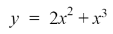
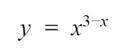

# Week 2 Practice Questions
Feel free to copy the code provided into your own MATLAB scripts to check your work! Please remember that although these are answers, there are multiple ways of doing the problem(s). We encourage you to develop your own method of writing and organizing your code!
- [Lectures](https://jacksonburns.github.io/MATLAB-Start-to-Finish/Lectures/Lectures-Landing-Page)
- [Practice Problems](https://jacksonburns.github.io/MATLAB-Start-to-Finish/Practice-Problems/Practice-Problems-Landing-Page)

To download this file as a PDF, go [here](https://github.com/JacksonBurns/MATLAB-Start-to-Finish/blob/master/Practice-Problems/Week-2/Mini-Assignment%20Week%202.pdf).

## Plotting Exercises
*Please remember to comment your code and label your graphs!*

1. Create a list of 101 numbers evenly spaced from 0 to 100. This will be our independent axis values. Create another list, applying the following formula to the values:
  - Graph the points on a graph
  - Using the same independent values, apply the following formula and add it to the same graph as in the previous part.
    - Afterwards redo the same, but now have two separate graphs for each plot.

*(PLEASE BE SURE TO LABEL YOUR AXIS, TITLE YOUR GRAPHS, AND LABEL YOUR LEGEND)*
(For simplification, have your x-axis and y-axis limits be from 0 => 5)

## Plotting Function

1. Create a function that accepts one matrix, a list of independent values, and labels for a graph. Within this function, apply the formulas from the Plotting Exercise 1a and 1b. Finally, have the function display a graph of both of the plots on the same graph.