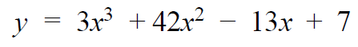

# Week 4 Practice Questions
Feel free to copy the code provided into your own MATLAB scripts to check your work! Please remember that although these are answers, there are multiple ways of doing the problem(s). We encourage you to develop your own method of writing and organizing your code!
- [Lectures](https://jacksonburns.github.io/MATLAB-Start-to-Finish/Lectures/Lectures-Landing-Page)
- [Practice Problems](https://jacksonburns.github.io/MATLAB-Start-to-Finish/Practice-Problems/Practice-Problems-Landing-Page)

To download this file as a PDF, go [here](https://github.com/JacksonBurns/MATLAB-Start-to-Finish/blob/master/Practice-Problems/Week-4/Mini-Assignment%20Week%204.pdf).

## Numeric/Symbolic Exercises
*Please remember to comment your code and label your graphs!*

1. Define the following function ​ **numerically** ​, then apply the following exercises to it
  - Evaluate the function at X = 77
  - Evaluate the function from X = 0 to X = 10

2. Define the following function, but this time ​ **symbolically** ​, then apply the following exercises.
  - Solve the function at X = 2 , Y = 4
  - Evaluate the function on the range of Y = [0, 1] with 100 points while keeping X = 1.
    - Graph the values from the previous exercise where the answer to b is your y-values going from 0=>99

