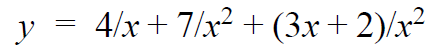
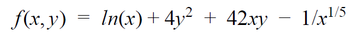
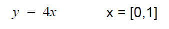

# Week 5 Practice Questions
Feel free to copy the code provided into your own MATLAB scripts to check your work! Please remember that although these are answers, there are multiple ways of doing the problem(s). We encourage you to develop your own method of writing and organizing your code!
- [Lectures](https://jacksonburns.github.io/MATLAB-Start-to-Finish/Lectures/Lectures-Landing-Page)
- [Practice Problems](https://jacksonburns.github.io/MATLAB-Start-to-Finish/Practice-Problems/Practice-Problems-Landing-Page)
To download this file as a PDF, go [here](https://github.com/JacksonBurns/MATLAB-Start-to-Finish/blob/master/Practice-Problems/Week-1/Mini-Assignment%20Week%201.pdf).

**Integration and Differentiation Exercises (Week 5)**
*Please remember to comment your code and label your graphs!*

1. Define the following function ​ **numerically** ​, then do the following exercises.

	a. Evaluate the function at X = 3
	b. Integrate the function with respect to X on the range from [1,10]

2. Define the following function ​ **symbolically** ​, then do the following exercises.

	a. Evaluate the function at X = 2, Y = 9
	b. Evaluate the Function on a range of Y = [0, 10] while keeping X = 5.
	c. Differentiate the function with respect to X, then evaluate the function at X = 6, Y = 3
	d. Integrate the function with respect to Y, then evaluate the function at the bounds X = [1,10], Y = [3, 12]

**Iterative Integral Analysis**

*This is an important function for the project!*
1. Define the following function ​ **either** ​numerically or symbolically, and find the value at which the lower and the upper integrals have the same value within the bounds. 
(Make sure your initial guess is NOT the actual answer)

